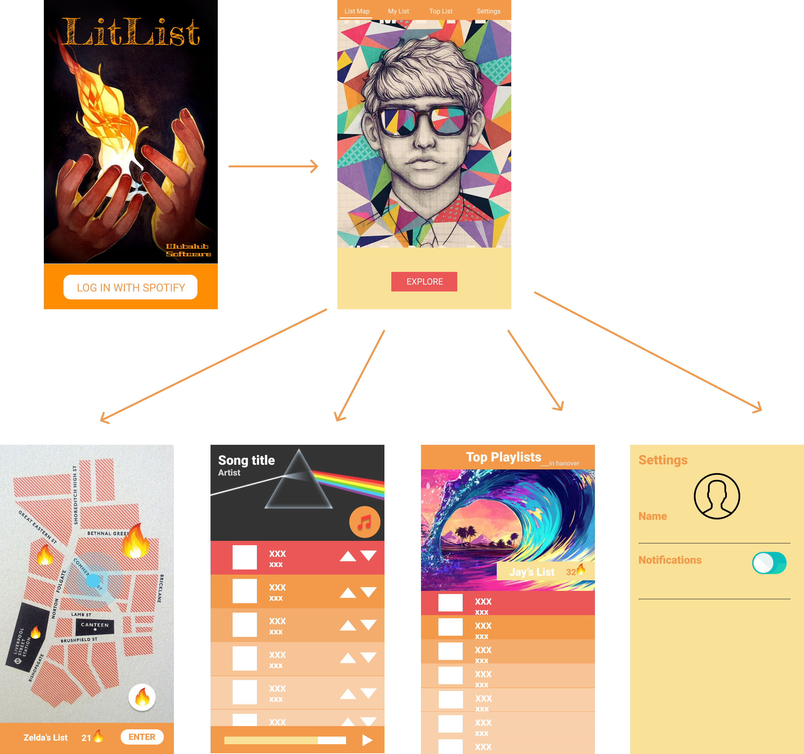

# LitList
The democratic, crowd-sourced playlist manager.

Team Wubalubadubdub: Josiah Putman, Lessley Hernandez, Sia Peng

## Project Idea
Our idea is to create an app that allows users to collaboratively create and manage playlist with other users in their area. This app can be used as an easy way to simultaneously listen to music with others and manage playlists live. Music has always been a way to express emotion and communicate feelings. Through this app we can allow people to share a piece of themselves through music. Users have the ability to see all public playlists in a map view, and joining, participating and giving your vote for the next song are all just a tap away. LitList allows users to use playlists as a liaison for understanding the musical atmosphere on campus.

LitList @Dartmouth?

Dartmouth has many barriers between the ability to be vulnerable on campus and expressing yourself. However, as much as we try to hide ourselves, our music taste and playlist can say a lot about us. Consider when people go through a heartbreak, trying to get hyped, or just want to focus. This form of expressing what we would like to project to ourselves through music doesn’t have to be an individual experience.

And finally...
DEMOCRACY! Something that has been tragically lost in 2k17 will be revived through the LitList! All members of a playlist will have the ability to upvote, downvote and add songs!

## User experience
- Login page - uses Spotify login, after successful login opens main view
- Main view - sliding tab layout
    - Map view
        - Google maps fragment appears, users can select playlist or create their own
        - User can hit the create button to open the create activity
    - Playlist view
        - When a playlist is selected, this shows the current songs in the playlist. Users can upvote, downvote and add their own songs
           - Lists songs in order of votes
        - If not selected, users can manage their song collection.
        - Contains buttons for stopping the current song, muting the media player, sharing to facebook and adding a song.
    - Rank view
        - Ranks playlists based on number of members listening
    - Settings view
        - Notification settings, etc.
- Create activity
    - Users edit the new playlist's name, their own display name, and a tag to categorize the music they want in their playlist.
- Facebook dialog
    - This view can be opened by pressing the share button in the playlist tab. This shares the current song's preview to Facebook
- Player service
    - Audio continues streaming in the background of the app because it is all run inside of a foreground service. A notification is created that displays the current song playing along with its album art.

## Implementation Notes
This section details our implementation and highlights known bugs.

### APIs
We used the following APIs:

#### Spotify
We used Spotify for authentication, music streaming and getting metadata. We used both the Spotify Android SDK (https://developer.spotify.com/technologies/spotify-android-sdk/) and a wrapper for the Spotify Web API (https://github.com/kaaes/spotify-web-api-android).

#### Google maps
We used the Google maps API for the playlist view.

### Sensors
We use an accelerometer for shake detection. Shaking the phone auto-joins the nearest session.
We also use GPS for getting location when creating playlists and joining others.

### Server development
We used Firebase to manage a database for all of the playlists. The database holds a list of Playlist objects, which contains all of the song ids, all of the users listening, the name of the creator, the name of the playlist, and a key to reference it by.

Each song object contains a track ID and a list of the user ids for people who upvoted/downvoted the track. The lengths of these lists are used for sorting the priority.

### Bugs
The Spotify Web API wrapper has some unstable Retrofit code inside of it which causes the app to crash if too many requests are sent. We need to use a different wrapper if we want to pursue this into the future.

Although the playlists themselves update automatically, the songs inside the playlist do not refresh unless the user leaves and rejoins the playlist. The song objects to not update with their parent objects due to Firebase's method of JSON parsing. We attempted to set a specific listener for each playlist and explicitly update the songs, but this process was slow and unreliable.

## UI Design
Here is our mockup on Figma.
https://www.figma.com/file/TadFx7fYTgYNrsfTsq5YclMd/LitListMockup

The follow are our mockups (actual app looks different).

