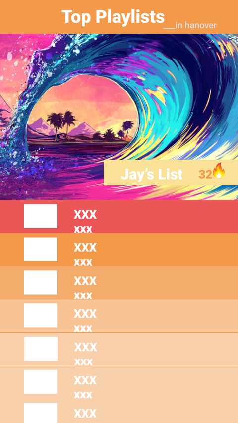

# LitList
The democratic, crowd-sourced playlist manager.

Team Wubalubadubdub: Josiah Putman, Lessley Hernandez, Sia Peng

## Project Idea
Our idea is to create an app that allows users to collaboratively create and manage playlist with other users in their area. This app can be used as an easy way to simultaneously listen to music with others and manage playlists live. Music has always been a way to express emotion and communicate feelings. Through this app we can allow people to share a piece of themselves through music. Users have the ability to see all public playlists in a map view, and joining, participating and giving your vote for the next song are all just a tap away. LitList allows users to use playlists as a liaison for understanding the musical atmosphere on campus.

LitList @Dartmouth?

Dartmouth has many barriers between the ability to be vulnerable on campus and expressing yourself. However, as much as we try to hide ourselves, our music taste and playlist can say a lot about us. Consider when people go through a heartbreak, trying to get hyped, or just want to focus. This form of expressing what we would like to project to ourselves through music doesn’t have to be an individual experience.

And finally...
DEMOCRACY! Something that has been tragically lost in 2k17 will be revived through the LitList! All members of a playlist will have the ability to upvote, downvote and add songs!

## TODO
* UI
    * Improved search UI
    * Pause, play, volume slider in the Playlist fragment
    * Settings fragment
    * Map markers
    * Map Panel (where you can press "join playlist" and see the playlist info)
    * Add a upvote/downvote button to the song view in the Playlist fragment

* Server
    * Receive GET requests for a list of all playlists
    * Receive GET requests for a nearest playlist
    * Receive POST requests for adding a song to a playlist, voting on a song
    * Send play messages ot all users in a playlist

### Why people should care
- Its a better way to experience and share music
- Understanding the musical environment on campus
- If you care about what people are thinking you care about what people are listening to

## User experience
- Login page - uses Spotify login, after successful login opens main view
- Main view - sliding tab layout
    - Map view
        - Google maps fragment appears, users can select playlist or create their own
    - Playlist view
        - When a playlist is selected, this shows the current songs in the playlist. Users can upvote, downvote and add their own songs
           - Shows the current song playing at the top
           - Lists songs in order of being added initially
        - If not selected, users can manage their song collection.
    - Rank view
        - Ranks playlists based on number of members listening and subscribed
    - Settings view
        - Notification settings, etc.

	Songs get upvoted and downvoted by users, which sorts the playing order

## Implementation Notes

### APIs
We used the following APIs:

#### Spotify
We used Spotify for authentication, music streaming and getting metadata. We used both the Spotify Android SDK (https://developer.spotify.com/technologies/spotify-android-sdk/) and a wrapper for the Spotify Web API (https://github.com/kaaes/spotify-web-api-android).

#### Google maps
We used the Google maps API for the playlist view.

### Sensors
Accelerometers, GPS.
Shaking the phone auto-joins the nearest session.

### Server development
This project required a server implementation. We are using Firebase to manage a list of created playlists, all users listening to the playlists, and all songs that have been added to those playlists.
The server sends

## UI Design
Here is our mockup on Figma.
https://www.figma.com/file/TadFx7fYTgYNrsfTsq5YclMd/LitListMockup
